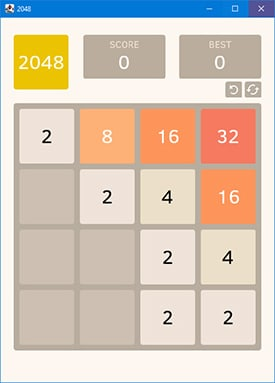

# 2048

It's a simple 2048 game implemented via [korge](https://korge.org/). You can play the game [here](https://rezmike.github.io/2048/).

You can follow the tutorial here: <https://blog.korge.org/korge-tutorial-writing-2048-game-step-1>

